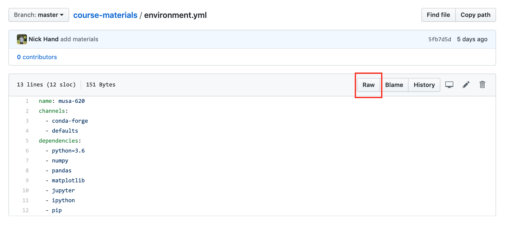

# Downloading environment files from Github

Environment files can be downloaded from GitHub using two methods.

### Method 1: Saving from Github

1. Navigate to the environment file on Github, for example, the environment file in the course materials
   repository is located at: https://github.com/MUSA-620-Fall-2019/course-materials/blob/master/environment.yml

2. Click on the "Raw" button to load a version of the file that only includes the text.

3. Once the raw version is opened, right click on the whitespace and select save as.

4. Save the file to a folder on your computer, and remember the file name for part 2 below.

### Method 2: Copying/pasting from Github

1. Follow the first two steps outlined above so that you are on the "Raw" version of the environment file.
1. Copy contents of the raw environment file.
1. Open up a plain text editor (either Notepad on Windows or TextEdit on Mac OS) and paste the contents of the file.
1. Save the file as "environment.yml" to a folder on your computer, and remember the file name for part 2 below.

### Important

When saving the environment file to your computer, following either of the methods above, make sure the file is saved with a .yml file extenstion. Sometimes, a .txt file extension will be automatically added to the end of the file name, which can create issues when trying to use the environment file. On Windows, the file extension can be changed using [these instructions](https://www.mediacollege.com/microsoft/windows/extension-change.html).
